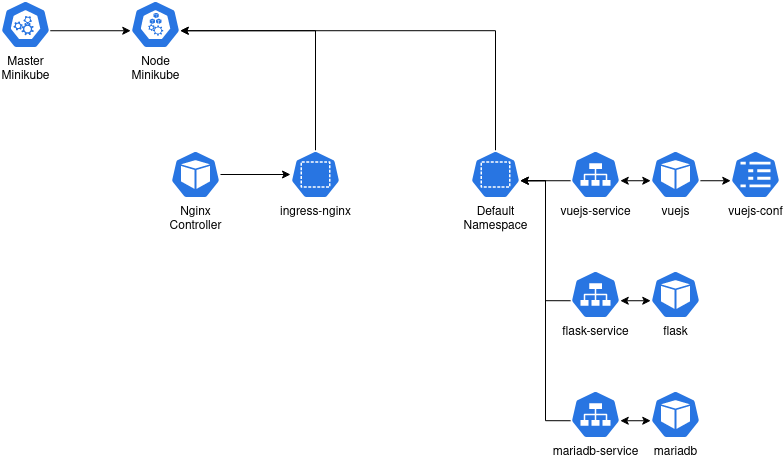

# My DevOps

## Build docker

```Bash
docker build src/BDD/ -t mariadb
docker build src/quiz-api/ -t flask
docker build src/quiz-ui/ -t vuejs
```

```Bash
docker run -d -e MYSQL_HOST="" -e MYSQL_USER="root" -e MYSQL_PASSWORD="rootroot" -e MYSQL_DB="QuizzDB" -p 5000:5000 --name flask flask
docker run -d -p 80:80 --name flask flask
docker run -d -p 3306:3306 --name flask flask
```

## Schema cluster k8s



## Minikube

```Bash
minikube start --cpus 4 --memory 8192
minikube addons enable ingress
minikube ip
```

## Kubernetes CMD

```bash
kubectl get pod
kubectl get service
kubectl exec [pod] -- bash
kubectl logs [pod] -n [namespace]
kubectl describe pod [pod] -n [namespace]
```

## Front-end Vuejs deployment

```bash
kubectl apply -f front/deployment.yaml
kubectl apply -f front/service.yaml
```

## Back-end Flask deployment

```Bash
kubectl apply -f back/deployment.yaml
kubectl apply -f back/service.yaml
```

## Database Mariadb deployment

```Bash
kubectl apply -f database/deployment.yaml
kubectl apply -f database/service.yaml
```

## Ingress Nginx deployment

```Bash
kubectl apply -f devops/ingress.yaml
```