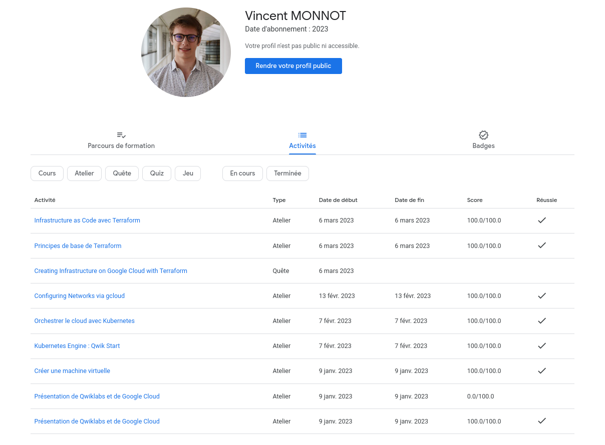
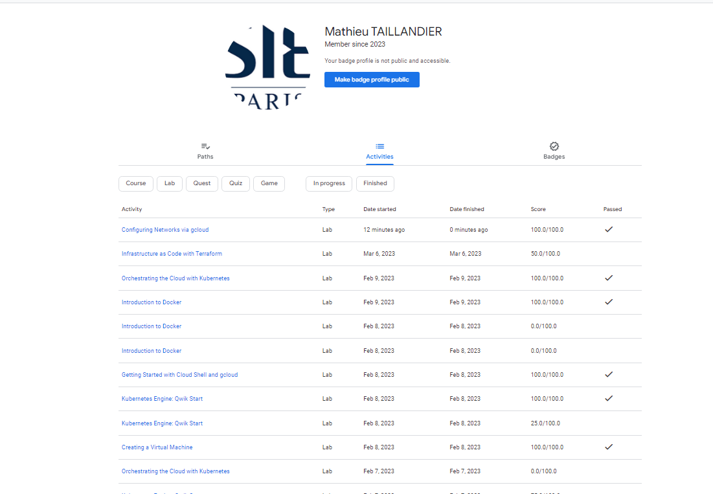

# My DevOps

Pour ce projet nous avons fait le choix de nous servir d'une application de Quizz réalisé au cours d'un projet précédent et qui possèdent l'avantage d'être un projet en "trois-tiers" avec front / back-end / database.
Nous avons décidé de réaliser une dockerisation de ces trois parties et de les exposer sur un noeud kubernetes en se servant de minikube.
Ne souhaitant pas se placer sur un google cloud avec un risque de facturation et possèdant déjà un serveur à la maison, nous avons décider de déployer notre noeud kube sur une VM Debian d'un Hyperviseur Proxmox exposé à travers le domaine suivant : https://sy3.monnot.org


## Cloudskillsboost profiles




## Docker

### Build images

```Bash
docker build src/BDD/ -t mariadb
docker build src/quiz-api/ -t flask
docker build src/quiz-ui/ -t vuejs
```

### Run Containers

```Bash
docker run -d -e MYSQL_HOST="" -e MYSQL_USER="root" -e MYSQL_PASSWORD="rootroot" -e MYSQL_DB="QuizzDB" -p 5000:5000 --name flask flask
docker run -d -p 80:80 --name vuejs vuejs
docker run -d -p 3306:3306 --name mysql mysql
```

## Schema cluster k8s


## Minikube setup

```Bash
minikube start --cpus 4 --memory 8192
minikube addons enable ingress
minikube ip
echo 'alias kubectl="minikube kubectl --"' >> ~/.bashrc
source ~/.bashrc
```

## Kubernetes Commands

```bash
kubectl get pod
kubectl get service
kubectl exec [pod] -- bash
kubectl logs [pod] -n [namespace]
kubectl describe pod [pod] -n [namespace]
```

## Database Mysql deployment

```Bash
kubectl apply -f database/deployment.yaml
kubectl apply -f database/service.yaml
```

## Back-end Flask deployment

```Bash
kubectl apply -f back/deployment.yaml
kubectl apply -f back/service.yaml
```

```Bash
minikube service mysql-service --url

http://192.168.49.2:30306
```

On modifie le fichier `k8s/back/configmap.yaml` avec les bonnes informations.

## Front-end Vuejs deployment

```bash
kubectl apply -f front/deployment.yaml
kubectl apply -f front/service.yaml
```

## Ingress Nginx deployment

```Bash
kubectl apply -f devops/ingress.yaml
```

En local :
```bash
minikube ip # IP du cluster
echo "192.168.X.X	front-end.intra" >> /etc/hosts 
```